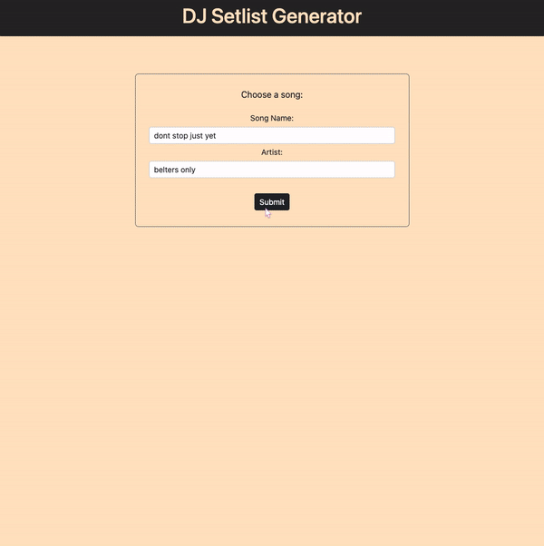

# DJ Flask Full-Stack App

*The best way to understand this app is to visit it [here](http://gabriella0101.pythonanywhere.com/)*

**Technologies Used**: Flask, Python, HTML , CSS, Javascript,  Spotify's API & Git

	
    
	
    
    
    
    

 

 

**Introduction**: This app aims to reduce the time consuming process DJ's go through in finding songs for their library. The app uses Spotify's extensive [API](https://developer.spotify.com/documentation/web-api/) with the python adapted [spotipy](https://spotipy.readthedocs.io/en/2.22.1/) package for simplicity. Using the Spotify API, we can access their complex recommendation feature which uses machine learning algorithms to suggest tracks based on a given seed track and user-defined parameters. This takes the standard spotify recommendation feature embedded in their app and extends its functionality by allowing DJ's to add constraints like BPM and key requirements. 

**Technology Overview**: For the backend, Python is used to communicate to the Spotify API and the flask web framework is used to create the web app. For the front-end, I use mainly HTML & CSS with some Javascript. The website is hosted for free on PythonAnywhere.

#### Example:

#### Back-End:
The app works as follows:

- Ask user for a search query, any song that they would like to find similar tracks for
- Use this search query to search the entire Spotify library to retrieve information about the user specified track
- Ask the user for requirements when searching for similar tracks, these include BPM, key & popularity
- Serves the user the similar tracks with the specified requirements

**Spotify's API**: I used two separate scripts, one for [track analysis](https://github.com/gabriella-martin/DJ-Flask-App/blob/main/spotify_api_pipelines/track_analysis.py) and another for [track recommendations](https://github.com/gabriella-martin/DJ-Flask-App/blob/main/spotify_api_pipelines/track_recommendations.py). The goal of the first script is to find the audio characteristics of the user specified track, these characteristics include BPM, key, popularity & energy. This track is now our seed track and its characteristics act as a baseline for recommendations. The second script collects the recommendations of that track with the user defined parameters.

**Flask**: I use the Flask web framework to create the app. The code for the flask app routes is [here](https://github.com/gabriella-martin/DJ-Flask-App/blob/main/main.py) and the code for the forms is [here](https://github.com/gabriella-martin/DJ-Flask-App/blob/main/forms.py). Flask handles the user inputs (POST) like the search query and recommendation parameters with forms which it then sends to the Python script accessing the API, it then serves the corresponding data (GET).

#### Front-End:

The HTML code for each page can found [here](https://github.com/gabriella-martin/DJ-Flask-App/tree/main/templates). I use a base [template](https://github.com/gabriella-martin/DJ-Flask-App/blob/main/templates/base.html) for repeatable HTML like the meta data & the nav-bar and then extend that template for each of my pages; home, song & set. Bootstrap is used alongside my own CSS which you can find [here](https://github.com/gabriella-martin/DJ-Flask-App/blob/main/static/css/main.css). I added some Javascript, [here], (https://github.com/gabriella-martin/DJ-Flask-App/blob/main/static/js/index.js) to create a more streamlined user experience. 

For the playable Spotify embed I just used their [embeds](https://developer.spotify.com/documentation/embeds/), this is by far one of the best developer tool spotify offers.